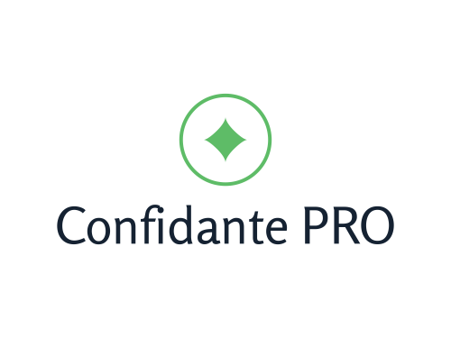
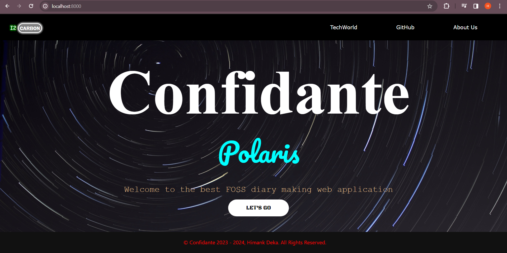

**A Django app to maintain your diary entries. Secured with encryption and authentication system.**

## Alert
The latest releases of this app will be available on [TechWorld](https://techworld856.godaddysites.com). Please go there to download them. 
This repository might be non-functional as we are starting the creation of a new version of Confidante here. 
We have launched a new variant of Confidante, The Confidante PRO. This version is better than the normal versions. This versions will be available exclusively on [TechWorld](https://techworld856.godaddysites.com).

# Screenshots

## Table of Content :
1. [Features](#features-)
2. [Dependencies](#dependencies-)
3. [Installation](#installation-)
4. [Copyrights](#copyrights-)
5. [Release Notes](#release-notes-)
6. [Contributing](#contributing-)
7. [Support](#support-)

## Features :
- Secure
- Encrypted
- Multiple users supported
- Entry creation system
- Account management system
- User Friendly UI
- Privacy

## Dependencies :
1. Python 3.11 or 3.12
2. Django

## Installation :

## Copyright :
See [COPYRIGHTS](./COPYRIGHTS.md)

## Release Notes :

### Release Polaris i1 Pre View :
This release is a preview of the web UI. Not functional yet. This release has some UI components and non-commercial. Please wait till we release our stable version.

**Patch Level: 2023.2.1.3**

Version Code: 0.1.2

Full Changelog: https://github.com/dev-hd11/Confidante/commits/v0.1.1

### Release Polaris i1 Pre View 2 :
This release contains database upgrades with a few UI improvement. This release is also a pre-view. Please wait for the full release.

[ADD] Staff Portal (v1): A lightweight alternative to Django Admin. Contains features to view the database. [BETA]  
[UPDATE] UI Components: Some new UI components in the homepage. 
[ADD] Database Models: New database, with tables for authentication system and diary entries. 
[FIX] Security Update: Security tokens updated. 

Version Code: 0.2.1

 **Patch level: 2023.3.1.4**

**Full Changelog**: https://github.com/dev-hd11/Confidante/compare/v0.1.1-p...0.2.0

### Release Polaris i1 RC1 :
This release is a part of the Pre-Views. This series let's you explore the project which is in the last phase of development. Full release coming soon.

[FIX] Bug fixes in Confidante UPS. 
[ADD] /star/ : Path for starring an entry. 
[ADD] /get_en/ : Path for viewing an entry. 
[ADD] /delete/ : Path for deleting an entry. 
[UPDATE] Staff Portal 2 : An updated version of Staff Portal. 
[ADD] Confidante UPS V1 : A system that reserves URLs for authenticated users only. [BETA] 
[DEPRECATED] Staff Portal - Star System changed.  
[UPDATE] UI components on all pages improved. 
[ADD] Confidante JAL V1 : Python library for Confidante UPS.  

**Patch level : 2023.9.3.12**

Version Code: 0.5.1

**Full Changelog**: https://github.com/dev-hd11/Confidante/compare/0.2.0...v0.5.1

### Release Polaris i1 CARBON :
Well now your long wait is over! Finally we are presenting you the OG release of our software...... **Confidante Polaris i1 CARBON**! It is the full release with all the functionalities and it is fully commercial edition. If you have downloaded any previous version please switch to this one.

Chnagelog :
[ADD] Powerded with CAuth Hercules II HYBRID: Now it is protected with our self built authentication system. 
[UPD] Staff Portal 4: Now we provide more protection and control over our users. 
[UPD] JAL R10+: JAL libraries upgraded including addition of Codes Lib. 
[UPD] UI Upgrades: We have upgraded our UI/UX. 
[ADD] Interface for logging in/signing up: Now you can login and sign up. 
[ADD] User Dashboard: We have attached a user dashboard for monitoring your account. 
[ADD] Password change: Now you can change your password. 
[ADD] Entries Form: Now you can create entries. 
[ADD] Runner 1.0: We have made an application which will run Confidante for you. 
[FIX] Fixing of various bugs related to Staff Portal and URL. 

**Patch level: 2023.20.6.26** 
Version Code: 1.0.0

**Full Changelog**: https://github.com/dev-hd11/Confidante/compare/v0.5.1...i1-CARBON

### Release Polaris i1 CARBON (Patched) :
A major bug in the Entry creation page has been patched. Please upgrade to this edition ASAP.

**Patch level: 2023.23.6.29** 
Version Code: 1.0.1 
**Full Changelog**: https://github.com/dev-hd11/Confidante/compare/i1-CARBON...i1-CARBON-Patched

### Release Polaris i2 CARBON Pre-view 1:
This is a pre-view of the latest version of Confidante. Please note that it will take some time till we release the fully stable Polaris i2 CARBON version. This is just a pre-view release so it may not be fully functional.

**Patch level: 2024.25.6.31** 
Version Code: 1.3.1 

**Full Changelog**: https://github.com/dev-hd11/Confidante/compare/i1-CARBON-Patched...i2-CARBON-pre1
## Contributing :
See [CONTRIBUTING](./CONTRIBUTING.md).

## Support
Having problems? Search for it in [NEWS](./NEWS.md) or in *Issues* or raise your own *issue*.
